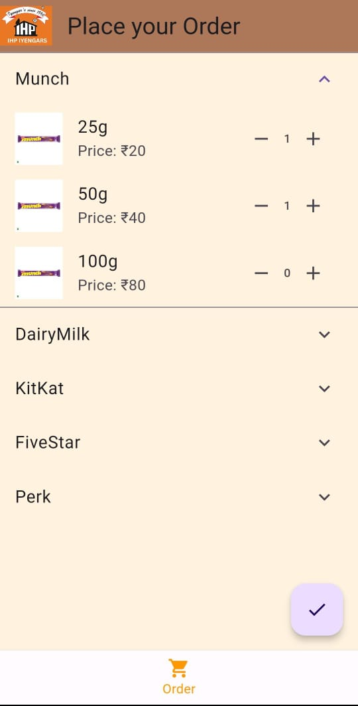

# Order_IHP

Order IHP is a Flutter application designed to simplify the process of placing orders for various products. With a user-friendly interface, it allows users to browse through available products, view different variants, add desired quantities to their cart, and review their orders before proceeding to checkout.

## Features:

- **Intro Screen:** Provides a welcoming interface with step-by-step instructions on how to place an order.
- **Order Navigation:** Enables users to navigate between different screens, such as browsing products and reviewing orders.
- **Product Catalog:** Displays available products with their respective variants, prices, and photos.
- **Add to Cart:** Allows users to add products to their cart by selecting the desired quantity.
- **Order Summary:** Provides a summary of the items added to the cart, along with their quantities.

## Screenshots:

## Usage:

1. Clone the repository: `git clone https://github.com/your-username/order_ihp.git`
2. Navigate to the project directory: `cd order_ihp`
3. Run the app: `flutter run`

## Technologies Used:

- Flutter
- Dart
